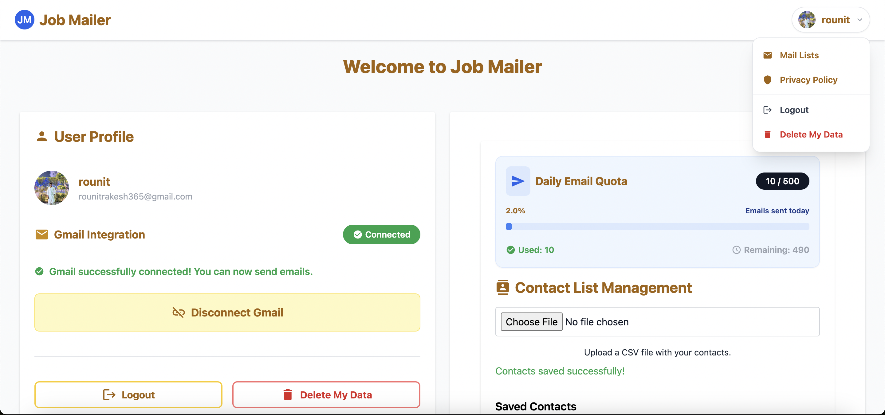
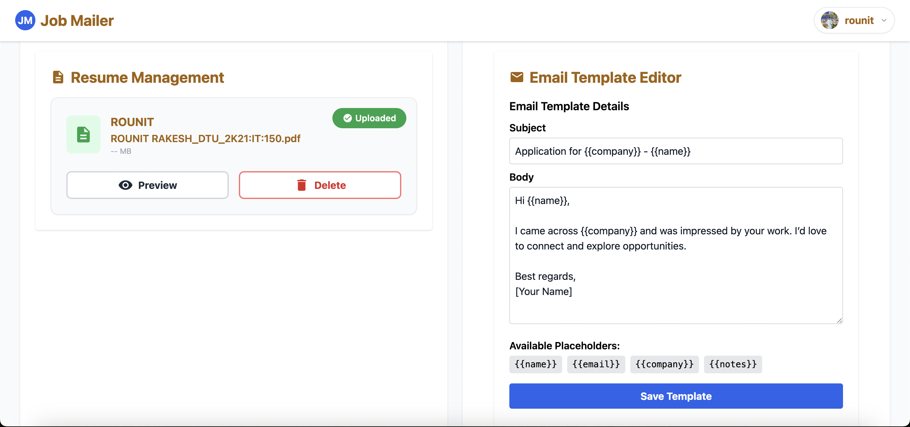
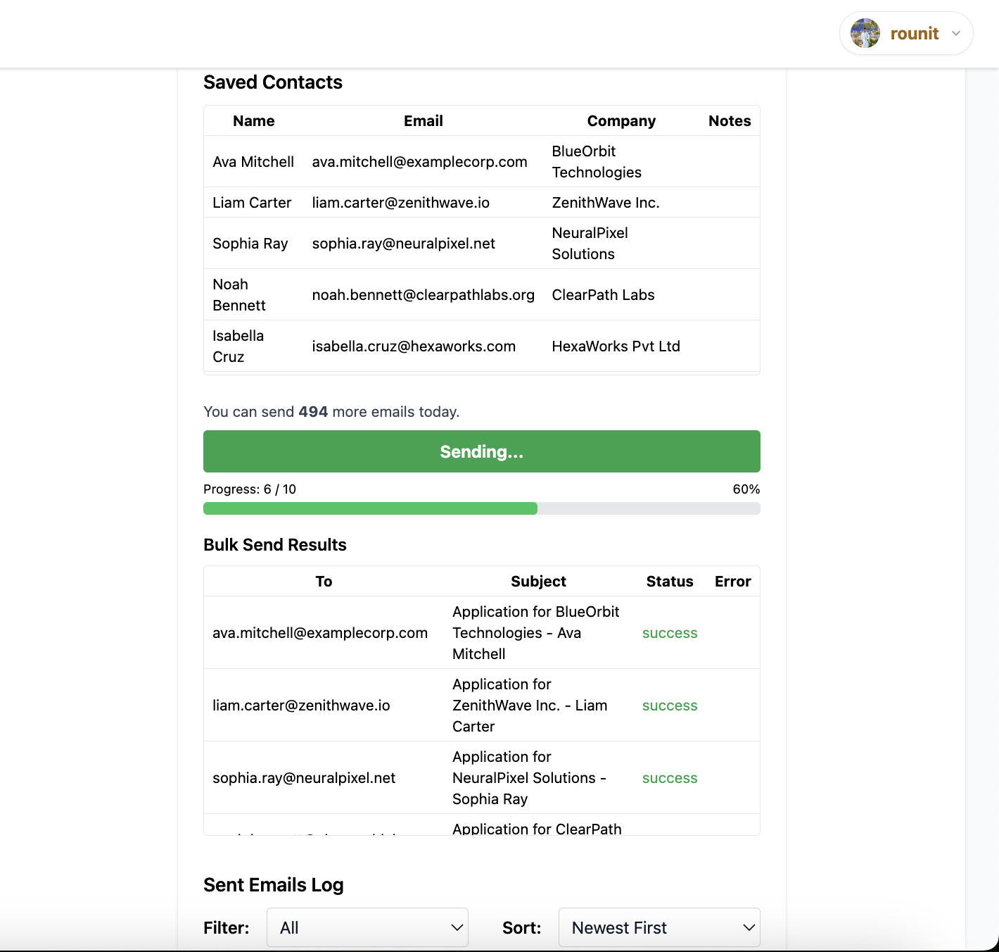

# Job Mailer

## Overview

Job Mailer is a modern, full-stack web application designed to automate and streamline the process of sending personalized cold emails to HRs and recruiters. Built with React (frontend), Node.js/Express (backend), and MongoDB, it leverages Gmail integration for secure, real email delivery. The UI is clean, card-based, and responsive, using Tailwind CSS for a professional look.







## Why This Project?

Searching for jobs and reaching out to HRs is time-consuming and repetitive. I built Job Mailer to:

- Save time by automating personalized outreach.
- Centralize contact, resume, and template management.
- Provide a secure, privacy-focused alternative to mass email tools.
- Learn and demonstrate full-stack development, OAuth, and cloud deployment best practices.

## Thought Process

The project was designed to be:

- **User-centric:** Simple, intuitive dashboard for non-technical users.
- **Secure:** Uses Google OAuth and never stores your Google password.
- **Scalable:** Easily deployable and maintainable for both personal and public use.
- **Transparent:** Clear privacy policy, data deletion, and user control features.

---

## 🚀 Hosted Website Usage

**Live site:** [https://job-mailer-ten.vercel.app/](https://job-mailer-ten.vercel.app/)

### Want to use the hosted website?

Due to Google OAuth restrictions, only approved test users can use the app while it is in "testing" mode.

**To get access:**

1. Email me your Google account address at: **rounitrakesh365@gmail.com**
2. I will add you as a test user in the Google Cloud Console.
3. You will then be able to log in and use all features on the hosted site.

---

## 🖥️ Local Development Setup

If you want to run Job Mailer locally (no test user restriction):

### 1. Clone the repository

```sh
git clone https://github.com/RounitR/job-mailer.git
cd job-mailer
```

### 2. Set up the backend

- Go to the `backend` folder:
  ```sh
  cd backend
  npm install
  ```
- Create a `.env` file with the following variables:
  ```env
  MONGODB_URI=your_mongodb_atlas_uri
  GOOGLE_CLIENT_ID=your_google_client_id
  GOOGLE_CLIENT_SECRET=your_google_client_secret
  GMAIL_REDIRECT_URI=http://localhost:5173/gmail-callback
  FRONTEND_URL=http://localhost:5173
  SESSION_SECRET=your_jwt_secret
  ```
- Start the backend:
  ```sh
  node index.js
  ```

### 3. Set up the frontend

- In a new terminal, go to the `frontend` folder:
  ```sh
  cd ../frontend
  npm install
  ```
- Create a `.env` file:
  ```env
  VITE_API_BASE_URL=http://localhost:5000
  VITE_GOOGLE_CLIENT_ID=your_google_client_id
  ```
- Start the frontend:
  ```sh
  npm run dev
  ```
- Open [http://localhost:5173](http://localhost:5173) in your browser.

---

## ✨ Features

- **Google Sign-In:** Secure login with your Google account.
- **Gmail Integration:** Send emails directly from your Gmail account (OAuth, no password stored).
- **Contact Management:** Upload, map, and manage HR/recruiter contacts via CSV.
- **Resume Management:** Upload, view, and delete your resume (PDF/DOCX, stored securely).
- **Email Template Editor:** Create and preview personalized email templates using Mustache placeholders.
- **Bulk Email Sending:** Send personalized emails to multiple contacts with live progress and quota tracking.
- **Daily Quota Tracking:** Visualize Gmail send limits and usage.
- **Privacy Controls:** Delete your account and all data at any time.
- **Responsive UI:** Modern, card-based dashboard with clear navigation and accessibility.

---

## 🧭 User Flow / Getting Started

1. **Sign in with Google** (OAuth popup).
2. **Connect your Gmail** (grant send permission).
3. **Upload your resume** (PDF/DOCX).
4. **Upload your contacts** (CSV, map fields as needed).
5. **Edit your email template** (customize subject/body with placeholders).
6. **Send bulk emails** (track progress, see logs, and quota).
7. **Delete your data** (optional, for privacy).


---

## 📄 License

MIT License. See [LICENSE](LICENSE) for details.

---

## 🙋‍♂️ Questions or Access Requests?

Email: **rounitrakesh365@gmail.com**

---
